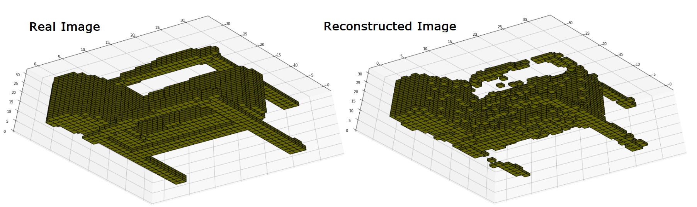

# Variational Autoencoder and Generative Adversarial Network for 3D Voxel Shapes

Real Image      ->      Reconstructed Image                         Real Image      ->      Reconstructed Image
   
